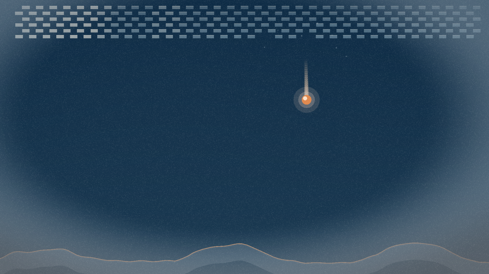
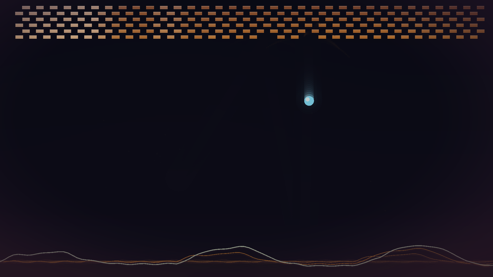

# 🍒 Cherry Visualizer

**A native, open-source music visualizer where the audio plays the game.**

Open a song. Pick a mode. Watch the music play it — no player, no controls,
no install, no server. One double-clickable executable, written in Rust.


| Waveform Breakout | Beat Surfer |
|---|---|
|  |  |
| Spectrum | Oscilloscope |
|  |  |
| Spectrogram | Starfield |
|  |  |

## The look

Every mode shares one art direction — *Dusk Encom*: a deep, slightly-cool
near-black holds most of the frame; color is mapped to **energy, not index**
(quiet sits in a calm teal family, loud lights up a single warm amber hero), and
the whole frame is finished with a graded backdrop and a soft vignette. No
rainbow ramps, no neon — it's graded like one photographed frame, not six
screensavers.

Motion comes from a **feedback buffer**: each frame decays toward the backdrop
before the new frame is drawn, so moving elements leave echo trails — the ball
becomes an amber comet, the scope gains phosphor persistence, the starfield
warps into a hyperspace tunnel. (The waterfall and the 3D runner opt out, where
trails would smear the time axis or the depth.)

### Themes

That art direction is **theme-driven**: the eight palette *roles* are fixed, but
their colors come from the active theme, so one switch re-skins every mode (and
its exports). It ships the house *Dusk Encom* plus **25 curated palettes from
[Lospec](https://lospec.com/palette-list)** (Oil 6, Ice Cream GB, FunkyFuture 8,
PICO-8, Sweetie 16, Apollo, …). A palette can have **any color count** — a
`from_colors` mapping folds a 3/4/5/6/8…46-color set onto the eight roles
(forcing a deep dark ground, a cool body, a warm hero) so even a tiny Game Boy
palette yields a full, dark-room-ready theme. There's also a live **Custom**
theme: pick Background / Body / Hero / Highlight with color pickers in
**Settings → Theme**, and the rest is derived. (`--theme <n>` on the CLI.)

| Sunset | Ember |
|---|---|
|  |  |

## The modes

Eleven so far, mixing the flagship "the audio plays the game" modes with the
classic music-visualizer staples:

**Waveform Breakout** — breakout with no player and no paddle sprite: **the live
waveform IS the paddle.** It forms a deforming surface along the bottom of the
arena that bats the ball up with power taken from the music's loudness. The
bricks are a lit cool wall (bonded courses, depth-shaded by row); the amber ball
is the single hero. Strong beats kick the ball, and the wall doesn't regenerate,
so a song slowly demolishes it.

**Spectrum** — frequency bars graded by energy: the whole bank sits in one cool
teal family separated by brightness, and only the single loudest band tips warm
as the hero. Log-weighted, jittered widths over an off-center baseline.

**Oscilloscope** — the raw waveform as a phosphor scope trace: one crisp teal
line whose loud crests glow amber, with older sweeps fading behind it.

**Spectrogram** — a scrolling time–frequency waterfall painted as heat in the
master palette: quiet bins recede into the ink floor, loud ones burn up to
amber and cream. Newest column at the right.

**Starfield** — the demoscene/screensaver warp-stars, flown by the music:
loudness sets the speed and every beat punches the field into hyperspace. Far
stars are dim teal, near ones warm to amber, the closest tip to cream.

**Tunnel** — demoscene concentric rings rushing an off-center vanishing point,
twisting on the treble and punching into warp on the beat, with a glowing eye.

**Polar Spectrum** — the 32-band spectrum wrapped into a mirrored, slowly
rotating ring: quiet bands hug the rim in teal, the loudest shoots out as amber.

**Nebula** — a particle bloom field: the treble sprays sparks out from a
luminous core, each spark's direction set by its frequency band, the mids swirl
the cloud, and beats burst it brighter.

**Vinyl** — a spinning record whose concentric grooves trace the live waveform;
loudness drags the platter faster and an amber label pulses on the beat.

**Beat Surfer** — a [Vib-Ribbon](https://en.wikipedia.org/wiki/Vib-Ribbon)-style
auto-runner played entirely by the music. At load the whole track is turned into
one obstacle **course**: every beat is classified by its spectral character into
a *typed* obstacle — a heavy/bass hit becomes an **arch** to leap, the music
dropping out becomes a **gap** to stride, sustained mids a **ring** to spin
through, treble a run of **teeth** to roll over — and then a min-gap sweep in
distance spaces them so they never crowd each other (which also makes the old
"jump on every beat" timing glitch *structurally* impossible: with the obstacles
guaranteed far enough apart, the avatar's pose is a clean pure function of how
far it's travelled, with no overlapping jump arcs to snap between). The track
itself is a single undulating **ribbon** whose surface *is* that obstacle height
field — a jump arch lifts the road, a gap dips it — rippled live by the waveform
and graded by loudness. The runner jumps, spins, rolls and strides exactly as
the obstacle it's clearing demands, and coins ride the same surface so each is
collected on the music. The ribbon is shaded by a **custom PBR material**
(see *The 3D look* below) — a brushed, normal-mapped metal surface that catches a
warm key light and throbs on the beat.

**Rail Shooter** — a StarFox-style on-rails flight the music flies, built on the
**same course generator**. Each typed event becomes a **wave** of angular wedge
fighters in a formation chosen by its kind (a line abreast, a V, an arc), and the
Arwing's twin lasers are fired *early* by their exact travel time — **laser
lead** — so the tracer strikes on the beat and the fighter bursts into debris.
Because a whole volley shares one beat, the wave reads as a musical phrase rather
than a spray. The open, melodic events flow **checkpoint rings**, the strongest
double-hits snap a **barrel roll**, bass breathes the canyon, and the corridor
floor and walls are lit, **normal-mapped** `.kkrieger`-style sci-fi panels (the
same PBR material — grid, seams, rivets baked procedurally, tinted by the theme,
so zero assets and it re-skins with the palette).

## The 3D look

The two 3D modes are lit by a small **custom PBR material** (`src/material3d.rs`)
written straight against macroquad's shader path — a world-space metallic-roughness
model (Cook-Torrance GGX + a fresnel rim + a beat-driven emissive) with
**procedurally-baked normal + roughness/metalness maps** (no image assets: a noise
height-field is Sobel'd into a normal map at load). The Surfer ribbon and the Rail
corridor carry real per-vertex world normals so the bump map has a frame to perturb;
everything is lit and distance-fogged in one shader pass. The maps are baked neutral
and tinted in-shader by the theme-graded vertex color, so a theme switch re-skins the
lit surfaces too, and the material renders identically through the offscreen video
exporter. (macroquad hands a custom material only `Model`+`Projection`, so there's no
view matrix — lighting is done in world space with the camera passed as a uniform.)

## Background image

**File ▸ Background image…** sets any image (png/jpg/…) as the backdrop. For the 2D
modes it sits under the visualizer (behind the feedback trails); for the 3D modes it
becomes the sky behind the lit world. **Settings ▸ Background** picks the fit
(cover / contain / stretch) and a dim level, and it survives theme switches and is
baked into video exports.

## Run it

```
cargo run --release            # build + launch
cargo run --release -- --file path\to\song.mp3
```

The binary lands at `target/release/cherry-visualizer.exe` — copy it anywhere
and double-click it. Supports mp3, wav, flac, ogg, m4a.

Cherry Visualizer opens to a normal **desktop UI** (egui): a **menu bar** (File / View /
Help), a **tabbed sidebar** — *Modes* (pick the visualizer), *Settings* (live
sliders for the selected mode), *Library*, *Export* — and a **transport bar**
with play/pause, a seek slider, and volume. Open a track from **File → Open** (it
decodes on a background thread, so the window never freezes), pick a mode, and
tune it live.

**Shortcuts:** `Space` play/pause · `Tab` next mode · `R` restart · `F`
fullscreen. With no track loaded, a built-in demo groove plays.

## Export to video

The **Export** tab renders the current mode to a 16:9 **MP4** with the track's
audio muxed in — pick 720p / 1080p / 1440p and 30 / 60 fps, hit *Export MP4…*,
and choose where to save. Rendering is **offscreen** at the chosen resolution
(independent of the window), so it's deterministic and frame-exact: the same
song always produces the same video. It needs [ffmpeg](https://ffmpeg.org/) on
your `PATH` (libx264 + aac).

There's also a headless CLI for batch jobs and CI:

```
cargo run --release -- --export out.mp4 --file song.mp3 --res 1080 --fps 60
```

## How it works

```
src/
  main.rs          egui desktop UI (menu/tabs/transport) + the app loop
  audio.rs         playback, the master clock, volume + seek (rodio)
  track.rs         decode to PCM + offline pre-analysis (beat grid, loudness)
  analysis.rs      per-frame FFT features (32 log bands, bass/mid/treble, rms)
  view.rs          world space -> letterboxed viewport + the offscreen-render
                   plumbing the exporter uses
  style.rs         the shared art direction: themes/palette, energy->color
                   grade, graded backdrop, vignette finish
  postfx.rs        the "alive" feedback pipeline (decaying echo trails)
  material3d.rs    custom PBR material + procedural normal/material maps (3D modes)
  export.rs        offscreen render -> raw frames -> ffmpeg -> MP4 (+ audio mux)
  modes/
    mod.rs         the Mode trait + the Param settings system
    breakout.rs    waveform-paddle breakout (rapier2d); live-tunable
    spectrum.rs    Winamp-style frequency bars with peak-hold caps
    scope.rs       glowing oscilloscope with phosphor persistence
    spectrogram.rs scrolling time-frequency heat waterfall
    starfield.rs   beat-warped projected starfield
    course.rs      shared audio->course generator (typed, distance-spaced obstacles)
    surfer.rs      Vib-Ribbon-style 3D auto-runner on a course (immediate-mode 3D)
    railshooter.rs StarFox-style rails shooter on the same course (laser lead)
```

Modes draw in a fixed 16:9 world and never touch pixels or the window, so the
exporter can re-render any of them — 2D or 3D — into an offscreen target at any
resolution just by overriding the logical screen size and render target.

Each mode exposes a list of named **params** (`Mode::params` / `set_param`) that
the Settings tab renders as sliders — so the ball speed, block size, court
height, columns and rows of Breakout are all live knobs in the UI.

The design that makes "the music plays the game" exact rather than reactive:
tracks are **pre-analyzed offline at load** (a beat grid with strengths, plus a
loudness curve at ~12 ms resolution), so modes can place things at *future*
beats instead of guessing in realtime. Every mode reads one `FrameCtx` — the
PCM window at the playhead, its spectral features, and that profile — and draws
in a fixed 16:9 world space. Adding a mode is one file plus one line in
`main.rs`.

Stack: [macroquad](https://github.com/not-fl3/macroquad) (window + 2D/3D),
[egui](https://github.com/emilk/egui) (desktop UI), [rapier2d](https://rapier.rs)
(physics), [rodio](https://github.com/RustAudio/rodio) (decode + playback),
[realfft](https://github.com/HEnquist/realfft) (spectrum),
[rfd](https://github.com/PolyMeilex/rfd) (native file dialog), and
[ffmpeg](https://ffmpeg.org/) (video export). All permissively licensed.

## Roadmap

The bigger vision — a large catalog of game/demo-inspired modes — lives in
[docs/MODES.md](docs/MODES.md) (225 catalogued concepts with audio mappings and
sources to adapt). The other docs in `docs/` are research from an earlier web
prototype; the mode catalog and strategy remain the guiding documents, ported
mode by mode into this native app.

Headless tools for development/CI (`cherry --help` lists them all): `--shot
<mode>` renders 180 frames on a silent fixed clock and writes a PNG;
`--export-frame <mode>` dumps one clean 1080p frame through the exporter; and
`--bench [mode]` times each mode's `update`+`draw` and prints a table, so visual
and perf changes can be measured.

## License

MIT. Jump timing ported from Chromium's T-Rex runner (BSD-style license, The
Chromium Authors); lane-runner mechanics referenced from the MIT-licensed
projects credited above.
