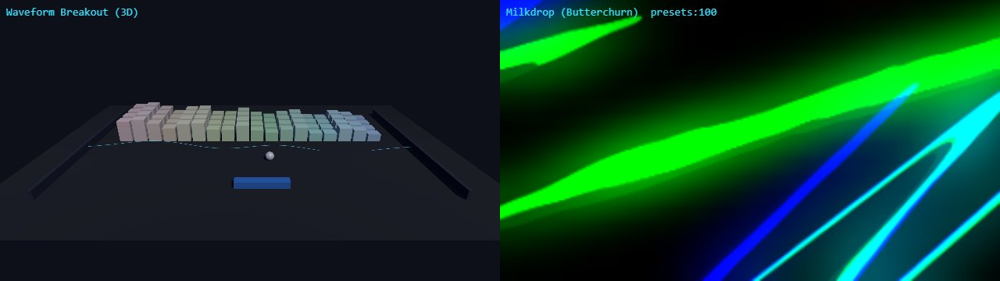
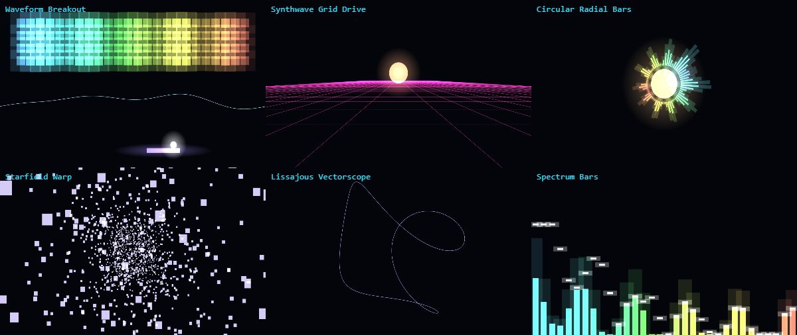

# 🍒 Cherry

**A modular, open-source music visualizer where every visual is a swappable plugin —
inspired by games, demos, and the whole history of audio-reactive code.**

Drop in an audio file, pick a mode, watch the music play it. Run it in a browser with zero
install, on the desktop, or headless to render a frame-perfect MP4 for a video.



*Left: Waveform Breakout — a lit 3D scene where the spectrum builds the brick wall and the waveform shoves the ball. Right: Milkdrop, via Butterchurn (MIT), with thousands of community presets.*

> Status: **Phase 2 — runnable, 7 modes.** The monorepo, the AudioFeatures bus, and the Mode ABI
> work end-to-end against a dropped audio file or mic — including a 3D arcade mode and the full
> Milkdrop preset engine. See the [roadmap](docs/ROADMAP.md) for what's next.



*Six modes, one ABI: Waveform Breakout · Synthwave Grid Drive · Circular Radial Bars · Starfield Warp · Lissajous Vectorscope · Spectrum Bars.*

---

## What makes it different

- **One plugin contract, every kind of visual.** Classic spectrum bars, demoscene shaders,
  GPU particle galaxies, 3D fly-throughs, **and** full physics games all implement the same
  tiny interface and composite through one render pipeline.
- **The music plays the game.** The flagship mode is a Breakout where the stereo **waveform
  forms the paddles** that push the ball and the **spectrum builds the bricks** — one of a
  whole category of arcade / runner / "oddly satisfying" modes.
- **225+ modes catalogued**, each with its exact audio→visual mapping and a permissively-licensed
  source to adapt from. See **[the catalog](docs/MODES.md)**.
- **Frame-perfect video export.** Modes are deterministic, so the same code that runs live in
  your browser renders a bit-identical MP4 — reproducible, channel-ready output.
- **Permissive by construction.** Everything shipped is MIT/BSD/Apache. Every GPL/LGPL/NC trap
  is mapped and routed around.

## The stack

TypeScript core · **Three.js WebGPU + TSL** (one shader source → WebGPU *and* a WebGL2 fallback) ·
a single **AudioFeatures bus** with realtime + deterministic drivers · lazy per-backend renderers
(TSL · raw-WGSL compute · OGL · regl · PixiJS · Phaser4+Rapier · Butterchurn) · three artifacts
from one repo: **web app → Tauri 2 desktop → headless video export.** Python is an *optional*
offline pre-analysis sidecar (BPM/key/beats), never a runtime dependency.

*Why not Python as the base? The visual code worth adapting — Butterchurn's 15k+ Milkdrop
presets, Shadertoy, three.js, Phaser — all lives in the web stack, and a URL is the whole
product. Full reasoning in [docs/PLAN.md](docs/PLAN.md#the-decision-you-asked-for-language--base).*

## Write a mode in ~20 lines

Every mode is one file implementing the ABI — declare which audio features you want, draw a frame:

```ts
const Plasma: VisualizerMode = {
  manifest: {
    id: "demo.plasma", name: "Plasma", apiVersion: "1.0.0",
    category: "shader", backend: "tsl",
    audioPorts: ["fftTex", "bass", "beat"],   // the only audio the host wires up
    deterministic: true, license: "MIT",
    params: { warp: { type: "float", default: 1.2, min: 0, max: 4, automatable: true } },
  },
  init(ctx)  { /* build a fullscreen TSL quad, bind uniforms */ },
  resize()   {},
  update(f)  { /* push f.bass, f.beat, f.fftTex into uniforms */ },
  render()   { /* draw one frame into ctx.outputTarget */ },
  dispose()  {},
};
```

The host owns the GPU context and the audio — modes never touch `AudioContext` or create a
canvas. Full contract in **[docs/ARCHITECTURE.md](docs/ARCHITECTURE.md)**.

## Run it locally

```bash
npm install        # workspaces: @cherry/core, @cherry/modes, @cherry/web
npm run dev         # Vite dev server → http://localhost:5173
npm run build       # production build of the web app
npm run typecheck   # tsc across the whole monorepo
```

Then open the page, **drop an audio file anywhere** (or click 🎤 Mic, or 🎲 Demo for a synthetic
signal), and use the dropdown to switch modes. Monorepo layout:

```
packages/core    @cherry/core   — Mode ABI, AudioFeatures bus, realtime + deterministic drivers (zero deps)
packages/modes   @cherry/modes  — 7 modes: breakout (3D), milkdrop, synthwave grid, radial bars, starfield, lissajous, spectrum bars
apps/web         @cherry/web    — the Vite host: renderer, audio input, mode switcher, HUD
```

## Documentation

| Doc | What's in it |
|-----|--------------|
| **[PLAN.md](docs/PLAN.md)** | Vision, the language decision, the gap we fill, scope discipline, success criteria. |
| **[ARCHITECTURE.md](docs/ARCHITECTURE.md)** | The Mode ABI, the AudioFeatures bus, all backends, the repo layout, the tech-choices table, and the hardening backlog. |
| **[MODES.md](docs/MODES.md)** | All 225 modes by category + a "greatest hits" starter set, with audio mappings, sources, and licenses. |
| **[ROADMAP.md](docs/ROADMAP.md)** | 8 phases — wow-demo first, then breadth, then export, then desktop. |
| **[STRATEGY.md](docs/STRATEGY.md)** | Licensing posture, contribution flow, and how the visualizer grows a music channel. |

## License

Core: **MIT.** Non-permissive preset/shader content is optional, user-loaded, and never bundled.
See [STRATEGY.md](docs/STRATEGY.md#licensing-posture).
