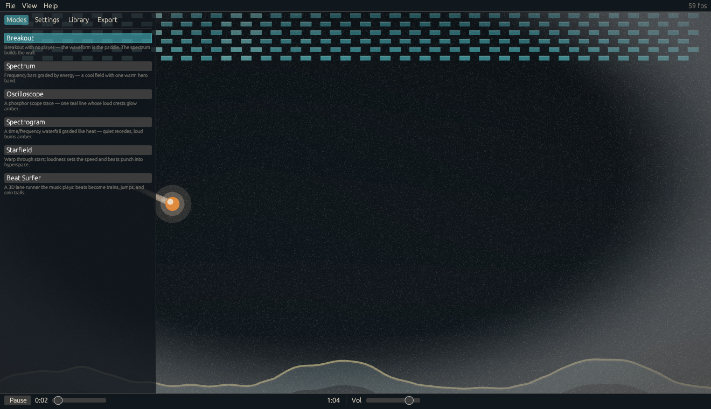
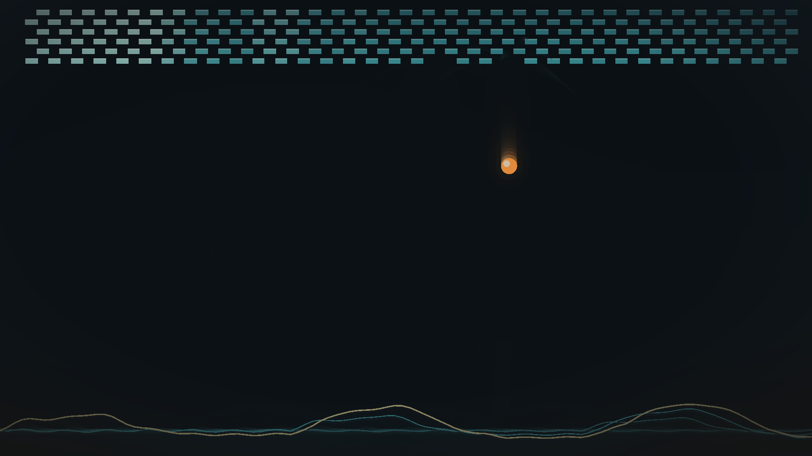
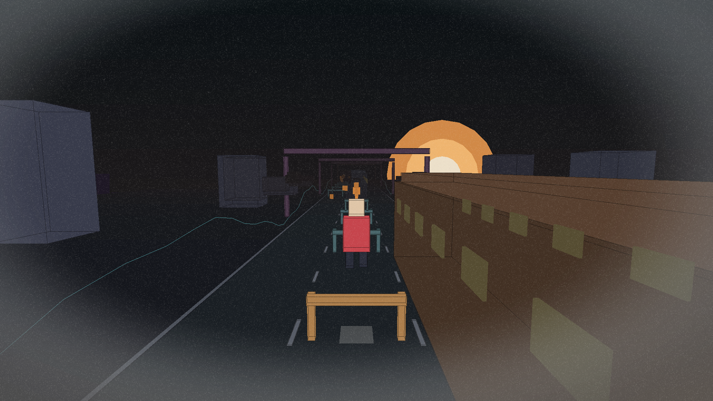
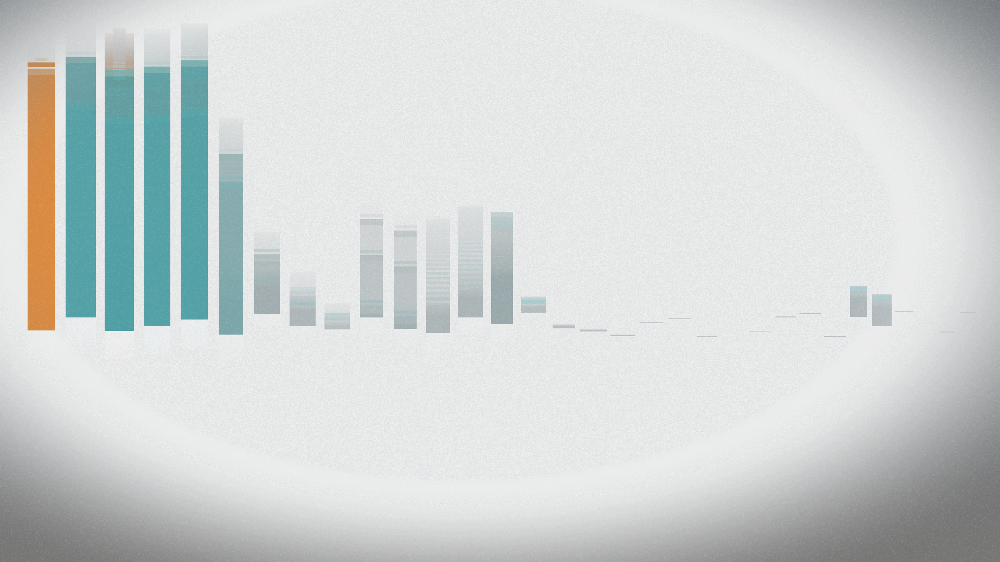
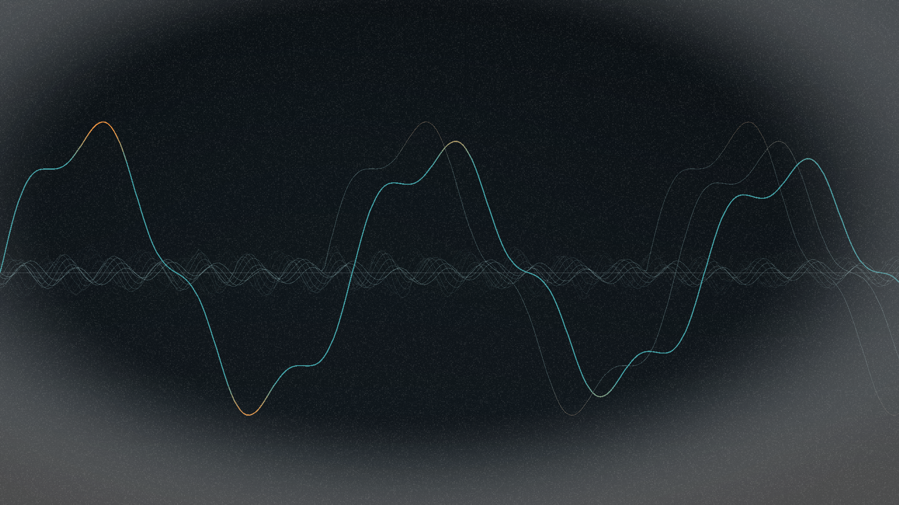
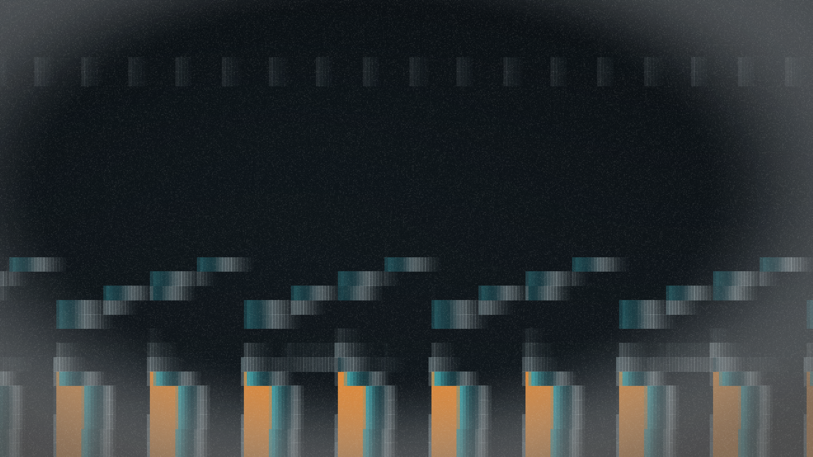
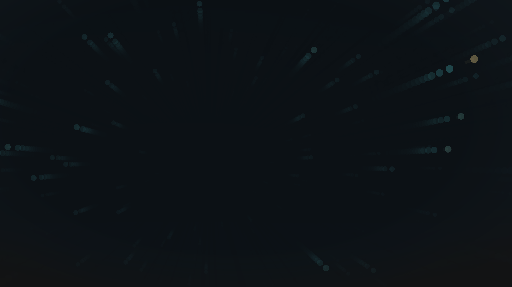

# 🍒 Cherry

**A native, open-source music visualizer where the audio plays the game.**

Open a song. Pick a mode. Watch the music play it — no player, no controls,
no install, no server. One double-clickable executable, written in Rust.



| Waveform Breakout | Beat Surfer |
|---|---|
|  |  |
| Spectrum | Oscilloscope |
|  |  |
| Spectrogram | Starfield |
|  |  |

## The look

Every mode shares one art direction — *Dusk Encom*: a deep, slightly-cool
near-black holds most of the frame; color is mapped to **energy, not index**
(quiet sits in a calm teal family, loud lights up a single warm amber hero), and
the whole frame is finished with a graded backdrop, a soft vignette, and fine
film grain. No rainbow ramps, no neon — it's graded like one photographed frame,
not six screensavers.

## The modes

Six so far, mixing the flagship "the audio plays the game" modes with the
classic music-visualizer staples:

**Waveform Breakout** — breakout with no player and no paddle sprite: **the live
waveform IS the paddle.** It forms a deforming surface along the bottom of the
arena that bats the ball up with power taken from the music's loudness. The
bricks are a lit cool wall (bonded courses, depth-shaded by row); the amber ball
is the single hero. Strong beats kick the ball, and the wall doesn't regenerate,
so a song slowly demolishes it.

**Spectrum** — frequency bars graded by energy: the whole bank sits in one cool
teal family separated by brightness, and only the single loudest band tips warm
as the hero. Log-weighted, jittered widths over an off-center baseline.

**Oscilloscope** — the raw waveform as a phosphor scope trace: one crisp teal
line whose loud crests glow amber, with older sweeps fading behind it.

**Spectrogram** — a scrolling time–frequency waterfall painted as heat in the
master palette: quiet bins recede into the ink floor, loud ones burn up to
amber and cream. Newest column at the right.

**Starfield** — the demoscene/screensaver warp-stars, flown by the music:
loudness sets the speed and every beat punches the field into hyperspace. Far
stars are dim teal, near ones warm to amber, the closest tip to cream.

**Beat Surfer** — a 3D lane runner (think Subway Surfers), played entirely by
the music. Cherry pre-analyzes the whole track at load and turns the beat grid
into choreography: strong beats become **trains** in the player's lane with a
swerve scheduled before they arrive, other beats become **barriers** with the
jump timed so its apex lands exactly on the beat (Chromium T-Rex airtime), and
treble runs become **coin trails laid along the player's own future path** —
curving through swerves, arcing over jumps, every coin collected on the music.
Live layers animate the world: bass pulses the portal pylons and the sun, mids
light the train windows and breathe the skyline, treble spins the coins and
twinkles the stars, loudness drives world speed and the camera's FOV.
Rendered as flat-shaded low-poly with hand-rolled distance fog and wire
outlines — no textures, no shaders. Mechanics referenced from MIT-licensed
open-source runners ([NovemberDev's Godot endless runner](https://github.com/NovemberDev/novemberdev-godot-endless-runner-tutorial),
[joaokucera's Unity endless runner](https://github.com/joaokucera/unity-endless-runner))
and jump timing from [Chromium's T-Rex runner](https://source.chromium.org/chromium/chromium/src/+/main:components/neterror/resources/dino_game/) (BSD).

## Run it

```
cargo run --release            # build + launch
cargo run --release -- --file path\to\song.mp3
```

The binary lands at `target/release/cherry.exe` — copy it anywhere and
double-click it. Supports mp3, wav, flac, ogg, m4a.

Cherry opens to a normal **desktop UI** (egui): a **menu bar** (File / View /
Help), a **tabbed sidebar** — *Modes* (pick the visualizer), *Settings* (live
sliders for the selected mode), *Library*, *Export* — and a **transport bar**
with play/pause, a seek slider, and volume. Open a track from **File → Open** (it
decodes on a background thread, so the window never freezes), pick a mode, and
tune it live.

**Shortcuts:** `Space` play/pause · `Tab` next mode · `R` restart · `F`
fullscreen. With no track loaded, a built-in demo groove plays.

## Export to video

The **Export** tab renders the current mode to a 16:9 **MP4** with the track's
audio muxed in — pick 720p / 1080p / 1440p and 30 / 60 fps, hit *Export MP4…*,
and choose where to save. Rendering is **offscreen** at the chosen resolution
(independent of the window), so it's deterministic and frame-exact: the same
song always produces the same video. It needs [ffmpeg](https://ffmpeg.org/) on
your `PATH` (libx264 + aac).

There's also a headless CLI for batch jobs and CI:

```
cargo run --release -- --export out.mp4 --file song.mp3 --res 1080 --fps 60
```

## How it works

```
src/
  main.rs          egui desktop UI (menu/tabs/transport) + the app loop
  audio.rs         playback, the master clock, volume + seek (rodio)
  track.rs         decode to PCM + offline pre-analysis (beat grid, loudness)
  analysis.rs      per-frame FFT features (32 log bands, bass/mid/treble, rms)
  view.rs          world space -> letterboxed viewport + the offscreen-render
                   plumbing the exporter uses
  style.rs         the shared art direction: palette, energy->color grade,
                   graded backdrop, vignette + film-grain finish
  export.rs        offscreen render -> raw frames -> ffmpeg -> MP4 (+ audio mux)
  modes/
    mod.rs         the Mode trait + the Param settings system
    breakout.rs    waveform-paddle breakout (rapier2d); live-tunable
    spectrum.rs    Winamp-style frequency bars with peak-hold caps
    scope.rs       glowing oscilloscope with phosphor persistence
    spectrogram.rs scrolling time-frequency heat waterfall
    starfield.rs   beat-warped projected starfield
    surfer.rs      beat-choreographed 3D lane runner (immediate-mode 3D + fog)
```

Modes draw in a fixed 16:9 world and never touch pixels or the window, so the
exporter can re-render any of them — 2D or 3D — into an offscreen target at any
resolution just by overriding the logical screen size and render target.

Each mode exposes a list of named **params** (`Mode::params` / `set_param`) that
the Settings tab renders as sliders — so the ball speed, block size, court
height, columns and rows of Breakout are all live knobs in the UI.

The design that makes "the music plays the game" exact rather than reactive:
tracks are **pre-analyzed offline at load** (a beat grid with strengths, plus a
loudness curve at ~12 ms resolution), so modes can place things at *future*
beats instead of guessing in realtime. Every mode reads one `FrameCtx` — the
PCM window at the playhead, its spectral features, and that profile — and draws
in a fixed 16:9 world space. Adding a mode is one file plus one line in
`main.rs`.

Stack: [macroquad](https://github.com/not-fl3/macroquad) (window + 2D/3D),
[egui](https://github.com/emilk/egui) (desktop UI), [rapier2d](https://rapier.rs)
(physics), [rodio](https://github.com/RustAudio/rodio) (decode + playback),
[realfft](https://github.com/HEnquist/realfft) (spectrum),
[rfd](https://github.com/PolyMeilex/rfd) (native file dialog), and
[ffmpeg](https://ffmpeg.org/) (video export). All permissively licensed.

## Roadmap

The bigger vision — a large catalog of game/demo-inspired modes — lives in
[docs/MODES.md](docs/MODES.md) (225 catalogued concepts with audio mappings and
sources to adapt). The other docs in `docs/` are research from an earlier web
prototype; the mode catalog and strategy remain the guiding documents, ported
mode by mode into this native app.

Headless tools for development/CI (`cherry --help` lists them all): `--shot
<mode>` renders 180 frames on a silent fixed clock and writes a PNG;
`--export-frame <mode>` dumps one clean 1080p frame through the exporter; and
`--bench [mode]` times each mode's `update`+`draw` and prints a table, so visual
and perf changes can be measured.

## License

MIT. Jump timing ported from Chromium's T-Rex runner (BSD-style license, The
Chromium Authors); lane-runner mechanics referenced from the MIT-licensed
projects credited above.
